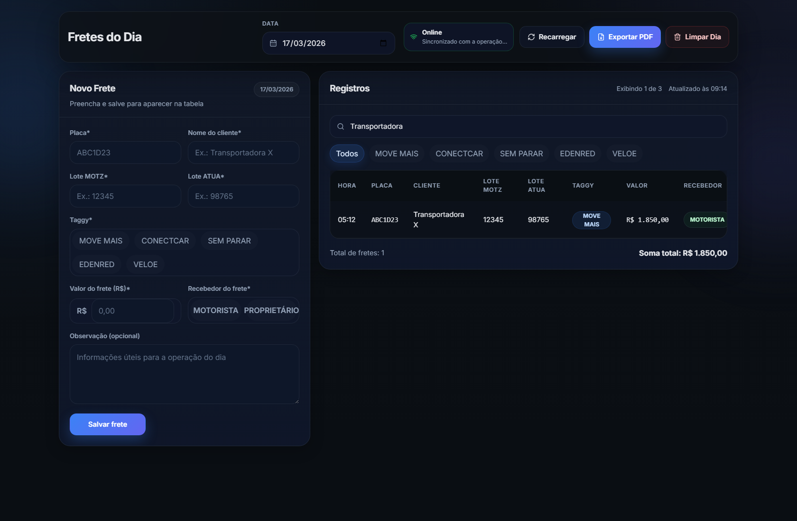

# Gerenciador de Fretes

Painel full-stack para controle diario de fretes operacionais. O sistema organiza os registros por data, permite cadastrar e editar fretes rapidamente, filtrar a operacao em tempo real, gerenciar opcoes de Taggy e exportar o fechamento do dia em PDF.



## Visao geral

Este projeto foi estruturado para um fluxo operacional simples e direto:

- cadastrar fretes do dia com placa, cliente, lotes MOTZ e ATUA, valor, recebedor e observacao;
- consultar todos os registros da data selecionada;
- editar ou excluir um frete individualmente;
- limpar todos os fretes de um dia com confirmacao;
- buscar por texto e filtrar por Taggy;
- sincronizar a tela com a API por polling leve;
- exportar a visao filtrada para PDF no navegador.

## Arquitetura

```text
apps/web (React + Vite)
        |
        | HTTP / JSON
        v
apps/api (Node.js + Express + Mongoose)
        |
        v
MongoDB Atlas
```

## Stack

| Camada | Tecnologias |
| --- | --- |
| Frontend | React 18, Vite, TypeScript, Tailwind CSS, Phosphor Icons, jsPDF |
| Backend | Node.js, Express, TypeScript, Mongoose, dotenv, cors |
| Banco | MongoDB Atlas |
| Workspace | npm workspaces |

## Principais funcionalidades

- CRUD completo de fretes por data.
- Status visual de conexao com suporte a estados `online`, `loading`, `offline` e `error`.
- Polling automatico a cada `7` segundos para manter varios dispositivos atualizados.
- Filtro por texto em `placa`, `cliente`, `loteMotz`, `loteAtua`, `taggy`, `receiver` e `observation`.
- Catalogo dinamico de Taggys com criacao e exclusao pela interface.
- Tabela responsiva com visao desktop e cards mobile.
- Exportacao de PDF respeitando a data selecionada e os filtros ativos.
- Endpoint de health-check para inspecao da API e do estado do banco.

## Estrutura do repositorio

```text
.
|- apps/
|  |- api/         # API Express + Mongoose
|  |  |- src/
|  |  |- .env.example
|  |
|  |- web/         # Frontend React + Vite
|     |- src/
|     |- public/
|     |- .env.example
|
|- artifacts/      # Capturas e referencias visuais
|- package.json    # Scripts raiz com npm workspaces
```

## Como executar localmente

### 1. Requisitos

- Node.js 20+
- npm 10+
- Uma conexao valida com MongoDB Atlas

### 2. Instale as dependencias

```bash
npm install
```

### 3. Crie os arquivos de ambiente

PowerShell:

```powershell
Copy-Item apps\api\.env.example apps\api\.env
Copy-Item apps\web\.env.example apps\web\.env
```

### 4. Configure as variaveis

#### `apps/api/.env`

```env
PORT=3001
MONGODB_URI=mongodb+srv://usuario:senha
CORS_ORIGIN=http://localhost:5173
```

#### `apps/web/.env`

```env
VITE_API_BASE_URL=http://localhost:3001/api
```

### 5. Rode a aplicacao em dois terminais

Terminal 1:

```bash
npm run dev:api
```

Terminal 2:

```bash
npm run dev:web
```

### 6. Acesse

- Frontend: `http://localhost:5173`
- API: `http://localhost:3001`
- Health check: `http://localhost:3001/api/health`

## Variaveis de ambiente

| App | Variavel | Obrigatoria | Descricao |
| --- | --- | --- | --- |
| API | `PORT` | Nao | Porta do servidor. Sem valor definido, a API usa `8080`. Para este projeto, `3001` e o valor recomendado. |
| API | `MONGODB_URI` | Sim para persistencia | String de conexao com o MongoDB Atlas. Sem ela, a API sobe, mas as rotas protegidas respondem `503`. |
| API | `CORS_ORIGIN` | Nao | Origem permitida no CORS. Pode receber multiplas origens separadas por virgula. O padrao local e `http://localhost:5173`. |
| Web | `VITE_API_BASE_URL` | Sim em producao | Base da API consumida pelo frontend. Em dev, sem valor definido, cai para `http://localhost:3001/api`. |

## Scripts uteis

| Comando | O que faz |
| --- | --- |
| `npm run dev:api` | Sobe a API em modo desenvolvimento. |
| `npm run dev:web` | Sobe o frontend em modo desenvolvimento. |
| `npm run build` | Gera o build das duas apps via workspaces. |
| `npm run start --workspace @fretes/api` | Executa a API compilada. |
| `npm run preview --workspace @fretes/web` | Faz preview local do build do frontend. |

## Modelo de dados principal

Cada frete salvo na colecao `freights` segue a ideia abaixo:

```json
{
  "date": "2026-03-24",
  "plate": "ABC1D23",
  "client": "Transportadora X",
  "loteMotz": "12345",
  "loteAtua": "98765",
  "taggy": "SEM PARAR",
  "freightCents": 150000,
  "receiver": "MOTORISTA",
  "observation": "Entrega prioritaria"
}
```

Tambem existe a colecao `taggy_config`, usada para guardar a lista de Taggys disponiveis na interface.

## Regras de negocio implementadas

- A data trabalha no formato `YYYY-MM-DD`.
- O frontend usa `America/Sao_Paulo` como referencia para data e hora.
- A placa e normalizada para maiusculas e validada nos formatos `ABC1D23` ou `ABC-1234`.
- O valor do frete e salvo em centavos (`freightCents`) para evitar inconsistencias com moeda.
- O recebedor aceita apenas `MOTORISTA` ou `PROPRIETÁRIO`.
- As Taggys sao normalizadas em caixa alta.
- Quando o banco nao esta pronto, a API continua viva e responde `503` para rotas protegidas, mantendo `/api/health` disponivel.

## API

Base URL: `/api`

| Metodo | Rota | Descricao |
| --- | --- | --- |
| `GET` | `/health` | Retorna o status da API e da conexao com o banco. |
| `GET` | `/freights?date=YYYY-MM-DD` | Lista os fretes da data informada. |
| `POST` | `/freights` | Cria um novo frete. |
| `PUT` | `/freights/:id` | Atualiza um frete existente. |
| `DELETE` | `/freights/:id` | Remove um frete especifico. |
| `DELETE` | `/freights/by-date?date=YYYY-MM-DD` | Remove todos os fretes da data selecionada. |
| `GET` | `/taggies` | Lista as opcoes de Taggy configuradas. |
| `POST` | `/taggies` | Adiciona uma nova Taggy. |
| `DELETE` | `/taggies/:name` | Remove uma Taggy da configuracao. |

## Fluxo da interface

- A topbar concentra a data selecionada, o status de sincronizacao e as acoes de recarregar, exportar PDF e limpar o dia.
- O formulario lateral serve tanto para criar quanto para editar fretes.
- A tabela consolida os registros da data, mostra o total filtrado e permite editar ou excluir rapidamente.
- O PDF exportado inclui data, horario de geracao, quantidade de registros e soma total dos valores.

## Escopo atual

- Nao ha autenticacao ou niveis de permissao.
- O projeto foi desenhado para operacao diaria, com foco em simplicidade e agilidade de uso.
- Nao ha fila, websocket ou sincronizacao em tempo real; a atualizacao e feita por polling.
- Credenciais reais nao fazem parte do repositorio.
